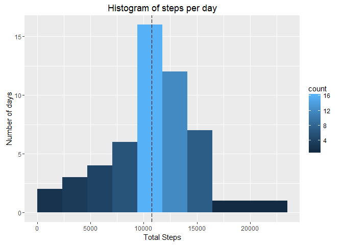
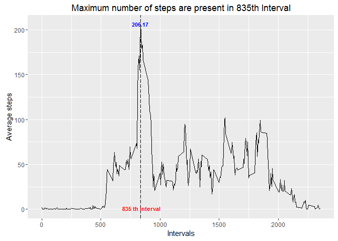
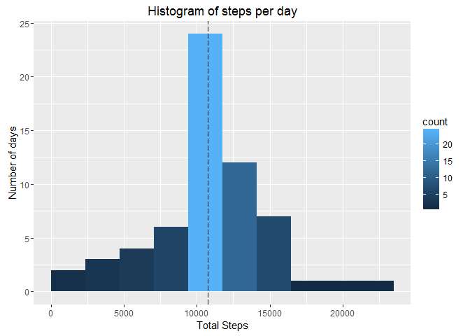
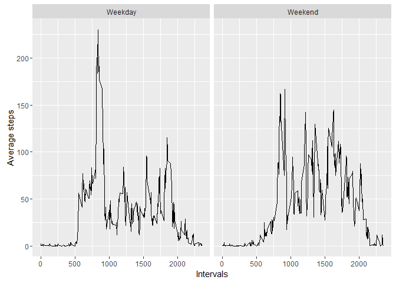

# Activity monitoring data

-------------------------------------------------------------------------- 

### Introduction

This assignment makes use of data from a personal activity monitoring device. This device collects data at 5 minute intervals through out the day. The data consists of two months of data from an anonymous individual collected during the months of October and November, 2012 and include the number of steps taken in 5 minute intervals each day.

The variables included in this dataset are:

**steps**: Number of steps taking in a 5-minute interval (missing values are coded as NA)  
**date**: The date on which the measurement was taken in YYYY-MM-DD format  
**interval**: Identifier for the 5-minute interval in which measurement was taken  


```
## 'data.frame':	17568 obs. of  3 variables:
##  $ steps   : int  NA NA NA NA NA NA NA NA NA NA ...
##  $ date    : Factor w/ 61 levels "2012-10-01","2012-10-02",..: 1 1 1 1 1 1 1 1 1 1 ...
##  $ interval: int  0 5 10 15 20 25 30 35 40 45 ...
```

-------------------------------------------------------------------------- 

### What is mean total number of steps taken per day?
  
Steps required:  
  
1. Load the data (i.e. read.csv())  
2. Process/transform the data (if necessary) into a format suitable for your analysis.  
3. Calculate the total number of steps taken per day.  
   Make a histogram of the total number of steps taken each day.  
4. Calculate and report the mean and median of the total number of steps taken per day  

```r
##Remove NA's from data
dat<-activity[complete.cases(activity),]

##group by days
groupDay<-group_by(dat,date)
##calculate total steps per day
stepsPerDay<-summarise(groupDay,total=sum(steps))

##calculate mean and median of total steps
meanSteps<-mean(stepsPerDay$total)
medianSteps<-median(stepsPerDay$total)

##plot histogram of total steps per day
g<-ggplot(stepsPerDay,aes(x=total))+geom_histogram(bins=10,aes(fill=..count..),origin=0)+
  labs(title="Histogram of steps per day")+ ylab("Number of days")+xlab("Total Steps")+
  geom_vline(xintercept = medianSteps,linetype="longdash")
print(g)
```

<!-- -->
 <br>Mean and Median of the total number of steps taken per day are <br>
 **Mean** : 1.0766189\times 10^{4} <br>
 **Median** : 10765  

-------------------------------------------------------------------------- 


### What is the average daily activity pattern?
  
To find this we plot time series plot (i.e. type = "l") of the 5-minute interval (x-axis) and the average number of steps taken, averaged across all days (y-axis)  

```r
##group by interval
groupInterval<-group_by(dat,interval)

##calculate steps per interval
stepsperInterval<-summarise(groupInterval,avg=mean(steps))
maxavg=max(stepsperInterval$avg)
maxinterval=subset(stepsperInterval,avg==maxavg)$interval

g1<-ggplot(stepsperInterval,aes(x=interval,y=avg))+geom_line() +
  labs(title="Maximum number of steps are present in 835th Interval")+ ylab("Average steps")+xlab("Intervals")+
  geom_text(aes(label=round(avg,2)),data=subset(stepsperInterval,avg==maxavg),colour = "blue", fontface = "bold",size=3) +
  geom_vline(xintercept =maxinterval ,linetype="longdash") +
  annotate("text", label = paste(maxinterval,"th interval"), x = maxinterval+10, y = 1, size = 3, colour = "red",fontface = "bold")


print(g1)
```

<!-- -->

-------------------------------------------------------------------------- 

### Imputing missing Values  

There are a number of days/intervals where there are missing values (coded as NA). The presence of missing days may introduce bias into some calculations or summaries of the data.  


```r
NAs<-sum(is.na(activity$steps))
```
Total number of missing values in dataset are  :2304  

We will fill missing values with median of steps per interval.  
Mean steps for each Interval are present in ***'stepsperInterval'*** variable calculated in previous section.  
  

```r
## copy original data
imputedData<-activity

i<-1

##loop through data, if missing value is present
## fill with average for that interval
while (i<= nrow(activity))
{
  if (is.na(activity[i,]$steps))
  {
    imputedData[i,]$steps <-   subset(stepsperInterval,interval==activity[i,]$interval)$avg
  }
  i<- i+1
}
```

Now we will use this data to plot histogram of the total number of steps taken each day and Calculate and report the mean and median total number of steps taken per day.  

```r
##group by days
groupDay1<-group_by(imputedData,date)
##calculate total steps per day
stepsPerDay1<-summarise(groupDay1,total=sum(steps))

##calculate mean and median of total steps
meanSteps1<-mean(stepsPerDay1$total)
medianSteps1<-median(stepsPerDay1$total)

##plot histogram of total steps per day
g2<-ggplot(stepsPerDay1,aes(x=total))+geom_histogram(bins=10,aes(fill=..count..),origin=0)+
  labs(title="Histogram of steps per day")+ ylab("Number of days")+xlab("Total Steps")+
  geom_vline(xintercept = medianSteps1,linetype="longdash")
print(g2)
```

<!-- -->

 <br>Mean and Median of the total number of steps taken per day are <br>
 **Mean** : 1.0766189\times 10^{4} <br>
 **Median** : 1.0766189\times 10^{4}    
   
So, we observe that filling missing values has no effect on Mean steps  
But, Median is shifted to right.  

-------------------------------------------------------------------------- 

### Are there differences in activity patterns between weekdays and weekends?
  
We will use imputed data set (***imputedData***) from previous section.  
We will create a new factor variable in the dataset with two levels - "weekday" and "weekend" indicating whether a given date is a weekday or weekend day and then compute average steps per interval for weekday and weekend.  


```r
##Add a column to identify day of week
imputedData1<-transform(imputedData,weekday=weekdays(as.Date(date,'%Y-%m-%d'),TRUE) )

## Add a factor column to identify if record belong to weekday or weekend
imputedData1<-transform(imputedData1,wkInd=ifelse(as.character(weekday)=='Sun'|as.character(weekday)=='Sat','Weekend','Weekday'))

##group by wkInd and interval
grpIntervalDay<-group_by(imputedData1,wkInd,interval)

##calculate steps per interval
stepsperIntervalDay<-summarise(grpIntervalDay,avg=mean(steps))
g3<-ggplot(stepsperIntervalDay,aes(x=interval,y=avg))+geom_line() + 
  ylab("Average steps")+xlab("Intervals")+
  facet_grid(. ~ wkInd)
print(g3)
```

<!-- -->
